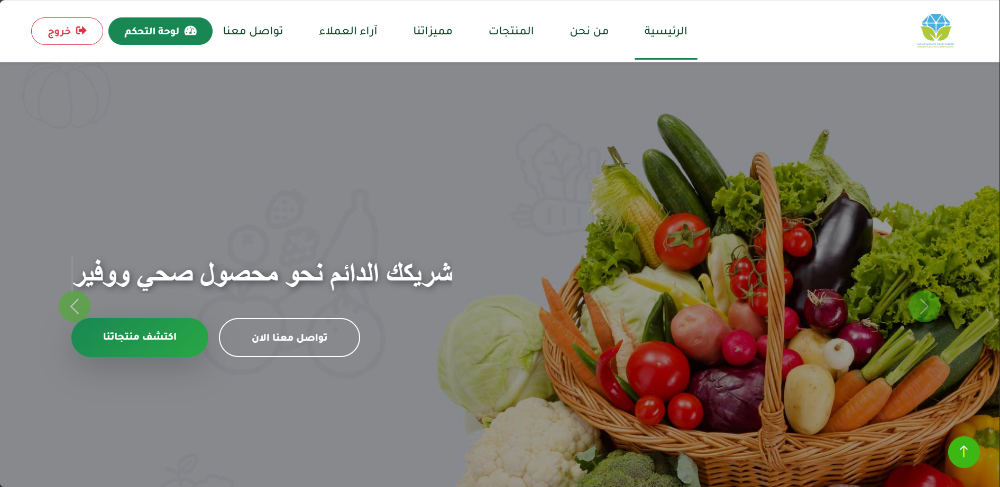
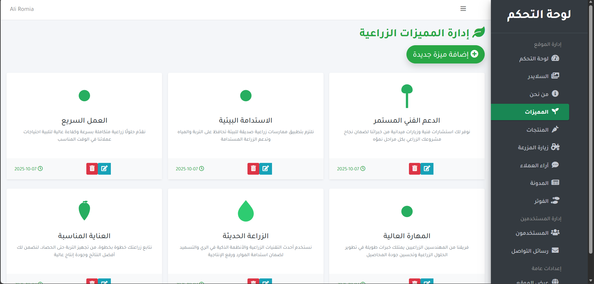
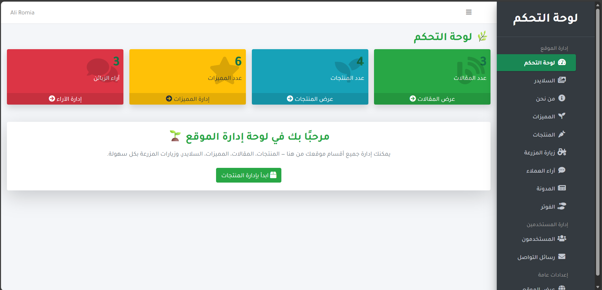

# 🌿 Almasah & Nebras Agricultural Company

A complete web platform for **Almasah & Nebras Agricultural Company**, featuring a modern **front-end website** and a powerful **admin dashboard** to manage all dynamic content — products, blogs, testimonials, and more.

---

## 🚀 Overview

This project was built using **Laravel 10**, designed to deliver a professional, responsive, and fully dynamic agricultural website.  
It includes a public-facing website for users and a full-featured admin panel for managing content efficiently.

### 🌱 Key Features
- 🏠 **Home Page** — Dynamic slider with promotional content  
- 🧑‍🌾 **About Section** — Company overview with interactive visuals  
- 🛒 **Products** — Display agricultural products with pricing and categories  
- ✨ **Features Section** — Highlights company strengths and services  
- 💬 **Customer Testimonials** — Interactive review carousel  
- 📰 **Blog** — Share news, tips, and company updates  
- 📩 **Contact Page** — Integrated contact form with message storage  
- ⚙️ **Admin Dashboard** — Manage everything with a clean interface

---

# Preview 







## 🧰 Tech Stack

| Category | Technology | Description |
|:--|:--|:--|
| **Back-End** | [Laravel 10](https://laravel.com/) | PHP framework powering the full app |
| **Front-End** | [Blade Templates](https://laravel.com/docs/10.x/blade) | Dynamic templating system |
| | [Bootstrap 5](https://getbootstrap.com/) | UI and responsive design |
| | [Font Awesome](https://fontawesome.com/) | Icon library |
| **Database** | MySQL / SQLite | Stores all dynamic content |
| **Admin Panel** | [Laravel-AdminLTE](https://github.com/jeroennoten/Laravel-AdminLTE) | Elegant admin dashboard |
| **Animation** | WOW.js + Animate.css | Smooth scroll and visual effects |
| **Carousel** | Owl Carousel | Dynamic sliders for testimonials and banners |
| **Hosting** | DreamHost | Production hosting platform |
| **Version Control** | Git + GitHub | Versioning and deployment |

---

## 🧱 Project Structure

├── app/

│ ├── Http/Controllers/

│ │ ├── Admin/

│ │ │ ├── AdminController.php

│ │ │ ├── ProductController.php

│ │ │ ├── TestimonialController.php

│ │ │ ├── FooterController.php

│ │ │ └── ContactAdminController.php

│ │ └── ContactController.php

│ ├── Models/

│ │ ├── Product.php

│ │ ├── Feature.php

│ │ ├── Testimonial.php

│ │ ├── Blog.php

│ │ ├── Footer.php

│ │ └── Slider.php

│
├── resources/views/

│ ├── home.blade.php

│ ├── partials/

│ │ ├── about.blade.php

│ │ ├── products.blade.php

│ │ ├── testimonials.blade.php

│ │ └── footer.blade.php

│ └── admin/
│ ├── contacts/

│ ├── products/

│ ├── blog/

│ └── features/

│
├── public/

│ ├── storage/

│ ├── images/

│ ├── css/

│ └── js/

│
└── routes/

├── web.php

└── auth.php

---

## ⚙️ Local Setup

### 1️⃣ Install Dependencies
```bash
composer install
npm install
 ```

### 2️⃣ Configure Environment

Copy the example environment file:
```bash
cp .env.example .env
 ```

Edit your database configuration: 
  ```bash
DB_CONNECTION=mysql
DB_HOST=127.0.0.1
DB_PORT=3306
DB_DATABASE=almasah_nebras
DB_USERNAME=root
DB_PASSWORD=
 ```

### 3️⃣ Generate App Key
```bash
php artisan key:generate
 ```

### 4️⃣ Run Migrations
```bash
php artisan migrate
 ```
### 5️⃣ Serve the Application
```bash
php artisan serve
 ```

Admin Panel :
 
Access the dashboard via:

/admin/dashboard

Features:

Manage Products

Manage Blog Posts

Manage Customer Testimonials

Manage Features

Manage Sliders

Manage Footer Content

View & Delete Contact Messages

Powered by AdminLTE for a clean and professional UI.


Section	Preview

🏠 Home	Dynamic slider and content

🌿 Products	Grid view with categories

💬 Testimonials	Animated customer reviews

🧑‍💻 Admin Dashboard	Clean, responsive control panel


Deployment :

Deployed on DreamHost Shared Hosting.

🧭 Future Improvements

🌍 Add English/Arabic language switch (multi-language support)

📱 Develop mobile app version (React Native)

⚡ Improve SEO performance and metadata

💾 Implement cloud image storage (AWS S3 or Cloudinary)

🪪 Please Do Not CLaim As Your Selve : This Website is Fuly Hosted On DreamHost And Licensed Under The Almasah & Nebras Business Company

   Any Reuse To This Code Under Another Business Name is Illegal 

   Developed By : 

   Ali Romia - Software Developer


